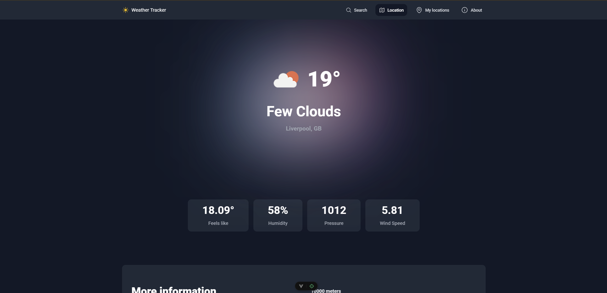
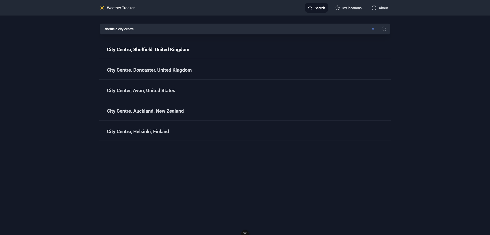

# weather-app

This is a weather app.

# setup

Firstly, please provide API keys for:

1. Maptiler: `views/SearchView.vue`
2. OpenWeatherMap: `components/WeatherData.vue`

then run:
`npm i` and `npm run dev`

# Details

This project was made for a bit of Vue practice and is super basic.
Feel free to use it if you like.

# Screenshots

